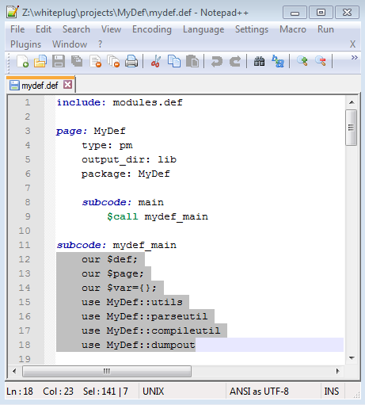

# Text Editor

In the course of showing people the power of MyDef, I have been surprised by how many people including experienced programmers who do not know an efficient way of editing text files. MyDef is a crusade toward claiming control and efficiency from catering toward machines. Watching some of my friends painstakingly go to notepad or wordpad editing the def file, manually maintaining the indentation of each line by pressing spaces, I can sympathize how they would find it difficult to appreciate MyDef. They merely want to get their jobs done, and MyDef just has become a new obstacle before finishing their jobs! 

MyDef is a power tool to help you get your job done much quicker, but you got to supply the electricity! Before we embark on learning how to use MyDef, I find it necessary to talk about text editors.

If you are a vim or emacs user, then you are already masters of text editing, go ahead skip this section. 

Actually I am going to talk a little bit about vim. Unlike other editors such as notepad, word, or Microsoft visual studio, vim is an editor that has a learning curve. The learning curve is not so steep that only people with how IQ can master, but a learning curve similar to riding a bike or driving a car. To get somewhere, you either ride a bus or drive your own car and initially drive your own car will be more difficult and more accident prone than riding a bus. But as soon as you pass a threshold, you'll see how the benefits overcome the effort. Vim is like that, and MyDef is like that.

But I am not going to insist on Vim. It is really a personal preference. I'll just emphasize a few basic features a sufficient editor need have for you to benefit from MyDef.

* Auto indentation

  If you find it ok to indent each subsequent line by pressing multiple spaces and refuse to change, you won't find MyDef beneficial at all. MyDef is about listen to your own complain during programming and do something about it. If you are fine with complaining or you havn't complained yet, life is good! Keep going!

* Syntax highlighting

  MyDef is about emphasizing semantic structure. Core part of MyDef syntax is designed to be easily highlightable. Visual contrast can significantly help us recognize those structures. In the MyDef installation, there is a mydef.vim syntax file in the docs folder for those vim user. For others, I will give an example below in notepad++ on how to create a custom sytax highlighter. I am against too much syntax highlighting, but a few basic highting can go a long way.

* Automatic detect external file modification

  MyDef tries to let you edit the way your mind sees it. But sometime what our mind thinks is not the reality. So from time to time, you probably need open the compiled output in your text editor side by side with your def source file (in addition, you probably want to have a terminal window open as well to quickly run the compile command, if your editor don't have a shell feature). It will be very frustrating when you are looking at stale output file and wondering why the def file didn't produce what you think it should.

Of course there are other features that you may want to have, but above is the basic ones in order for you to benefit from MyDef.

For windows user, I am going to recommend notepad++ if you don't already have a preferred text editor. If you don't know what is notepad++, just search it on the internet, it is free.

  
In notepad++, in addition to auto indentation, you can mass indent a block by selecting the block and press "TAB". Or you can mass de-indent a block by pressing "Shift+TAB". You will do this very offten in MyDef.

It is really easy to create basic syntax highlighting in Notepad++. Goto menu "Language", then "Define your language...", Set Ext. to "def", head to the "Keywords Lists" tab, insert groups of keywords as shown in the screenshot below: 

Go to "Comment & Number" tab, enter as shown in the screenshot below:

I would skip highlighting numbers. Optionaly, go to "Operators & Delimiters" and highlight strings as shown in the screenshot below:

Now you are all set!
