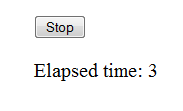

# JavaScript

MyDef:

```
page: js_example, js_frame
    title: JavaScript Example
    subcode:: content
        CSS: div.counter {margin: 20px auto; width: 200px; font-size: 20; text-align: middle}
        $div counter
            $button #button, "Start"
            $p #output, /

    subcode: js_onload
        $map load_element, output, button

        $global n_time=0

        &call listen, button, click
            $if n_time==0
                &call setInterval, timer_counter, 1000
                    n_time+=1
                    output.innerHTML="Elapsed time: $n_time"
                button.innerHTML="Stop"
            $else
                clearInterval(timer_counter)
                button.innerHTML="Restart"
                n_time=0
```

Compile:
```
$ mydef_page -mwww js_example.def
PAGE: js_example
  --> [./js_example.html]
```

The JavaScript output:

```
<!doctype html>                            
<html>
    <head> 
        <meta charset="utf-8"> 
        <title>JavaScript Example</title>
        <style>
            div.counter  {margin: 20px auto; width: 200px; font-size: 20; text-align: middle} 
        </style>         
        <script type="text/javascript">
            var output;           
            var button;           
            var n_time=0;       
            var timer_counter;
            window.onload = function(){
                output = document.querySelector("#output"); 
                button = document.querySelector("#button");
                button.addEventListener("click", function(event){  
                    if(n_time==0){ 
                        timer_counter = window.setInterval(function(){
                            n_time+=1;  
                            output.innerHTML= "Elapsed time: " + n_time                        
                        }, 1000); 
                        button.innerHTML="Stop";
                    }         
                    else{
                        
                        clearInterval(timer_counter);
                        button.innerHTML= "Restart";
                        n_time=0;         
                    }                    
                }, false);                  
            };                          
        </script>                         
    </head>                               
    <body>                            
        <div class="counter">            
            <button id="button">Start</button>  
            <p id="output"></p>           
        </div>                          
    </body>       
</html>                           
```
And in browser:




