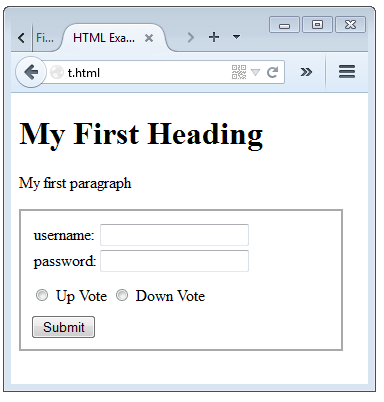

# HTML
HTML is not exactly a programming language, and it is easy to grasp. But don't we all hate the cumbersomeness of those tags! Naturally, I would like to edit my HTML page something as: 
```
page: example, basic_frame
    title: HTML Example Page
    subcode: content
        $h1
            My First Heading
        $p
            My first paragraph

        $div form
            CSS: div.form {padding: 10px; width: 300px; border: 2px solid darkgray;}
            CSS: div.form_line {margin-top: 10px;}
            $form #form1, action:example_form.php
                $call input_hidden, secret, 1234
                $table
                    $map form_input, username, password
                $div form_line
                    $call input_radio, vote, 1, Up Vote
                    $call input_radio, vote, 0, Down Vote
                $div form_line
                    $call input_submit, Submit
```

Let's compile it:
```
$ mydef_page -mwww example.def
PAGE: example
  --> [./t.html]
```

And here is the comipiled HTML page:

```
<!doctype html>                                                                       
<html>                                                                                
    <head>                                                                            
        <meta charset="utf-8">                                                        
        <title>HTML Example Page</title>                                              
        <style>                                                                       
            div.form  {padding: 10px; width: 300px; border: 2px solid darkgray}       
            div.form_line  {margin-top: 10px}                                         
        </style>                                                                      
    </head>                                                                           
    <body>                                                                            
        <h1>                                                                          
            My First Heading                                                          
        </h1>                                                                         
        <p>                                                                           
            My first paragraph                                                        
        </p>                                                                          
        <div class="form">                                                            
            <form id="form1" action="example_form.php" method="POST">                 
                <input type="hidden" name="secret" value="1234">                      
                <table>                                                               
                    <tr>                                                              
                        <td class="label">                                            
                            <div class="formlabel">                                   
                                username:                                             
                            </div>                                                    
                        </td>                                                         
                        <td class="input">                                            
                            <input type="text" class="textinput" name="username">     
                        </td>                                                         
                    </tr>                                                             
                    <tr>                                                              
                        <td class="label">                                            
                            <div class="formlabel">                                   
                                password:                                             
                            </div>                                                    
                        </td>                                                         
                        <td class="input">                                            
                            <input type="password" class="textinput" name="password"> 
                        </td>                                                         
                    </tr>                                                             
                </table>                                                              
                <div class="form_line">                                               
                    <input type="radio" name="vote" value="1"> Up Vote                
                    <input type="radio" name="vote" value="0"> Down Vote              
                </div>                                                                
                <div class="form_line">                                               
                    <input type="submit" value="Submit">                              
                </div>                                                                
            </form>                                                                   
        </div>                                                                        
    </body>                                                                           
</html>                                         
```
If we open in a browser, we have:


