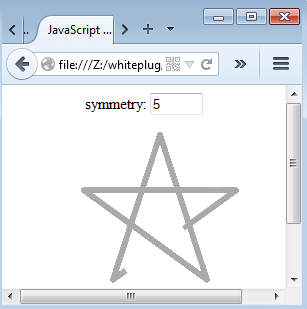

# JavaScript

This example is slightly longer. I would like to do something interesting, as well as showcase MyDef's capability in handling complexity. 



[Suggestion: simply focus on the page part and try to guess what it does; reference the screen shot see if it helps. Then move on to specific subcodes one at a time.]

[It's OK to simply skip these examples. You can always come back after you finish a few chapters later.]

MyDef:

```
macros:
    size: 200
    KEY_ENTER: 13

page: js_example, js_frame
    title: JavaScript Example
    subcode:: content
        CSS: div.box {margin: 0 auto; text-align: center}
        $div box
            symmetry: <input type="text" id="symmetry_input" size=4>
        $tag canvas, #canvas, /

    subcode: js_onload
        $map load_element, symmetry_input
        symmetry_input.value="5"
        $call 2d_init, canvas
        &call listen, symmetry_input, keyup
            $if event.which == $(KEY_ENTER)
                $call set_symmetry, parseFloat(symmetry_input.value)
                $call draw_reset

        &call animate
            $call draw_step, dt/1000

```
There is another part of code lists the details, but let's pause and reflect on what we did. We have isolated a higher level contexts that one can simply try to comprehend what is going on. Of course you won't know exactly what "2d_init" do, and what "draw_reset" or "draw_step" do, but do you really need exact details before you comprehend at this context? Other than missing details, we see everything. Knowing we are not missing anything is a very important step in comprehension.

Now we got the whole picture in the back of our mind, let's check out the gory details:

```
#---------------------------------------- 
subcode: 2d_init(canvas)
    $call load_element, $(canvas)
    canvas.width=window.innerWidth
    canvas.height=window.innerHeight
    $global surface
    surface=canvas.getContext("2d")
    surface.lineWidth=5
    surface.strokeStyle='#aaaaaa'
    surface.lineJoin="round"

    $global ox, oy, radius
    ox=canvas.width/2
    oy=$(size)/2
    radius=$(size)/2*0.8
    $call set_symmetry, 0
    $call math_step, 0

subcode: set_symmetry(symmetry)
    $global symmetry=5
    symmetry=$(symmetry)
    $if isNaN(symmetry) || symmetry<2 || symmetry>100
        symmetry=5

subcode: draw_reset
    surface.clearRect(0,0, canvas.width, canvas.height)
    $call math_step, 0

subcode: draw_step(delta_time_in_second)
    $global n_lines=0
    $if n_lines>symmetry
        surface.clearRect(0,0, canvas.width, canvas.height)
        n_lines=0

    #-- draw $(speed) pixels per second, df is the one pixel fraction
    $(set:speed=$(size)/2)
    cf+=df*$(speed)*($(delta_time_in_second))
    surface.beginPath()
    surface.moveTo(x0+(x1-x0)*0.9, y0+(y1-y0)*0.9)
    surface.lineTo(x1, y1)
    $if cf>1.0
        surface.lineTo(x2,y2)
        beta1=beta2
        $call math_step, 1
        n_lines++
    $else
        surface.lineTo(x1+(x2-x1)*cf, y1+(y2-y1)*cf)
    surface.stroke();

#----------------------------------------
#-- Math will be difficult no matter what.
#-- I isolate them here so we can put on math cap before engaging.
macros:
    C: Math.cos($1)
    S: Math.sin($1)
    Pythogrean: Math.sqrt(($1)*($1)+($2)*($2))
    Pi: Math.PI

subcode: math_step(mode)
    $global alpha, beta1, beta2, x1, y1, x2, y2
    $global cf, df
    $(if:mode=0)
        alpha=$(Pi)/symmetry
        beta1=-$(Pi)/2
        cf=0
        x0=ox+radius*$(C:beta1)
        y0=oy+radius*$(S:beta1)
    $(else)
        x0=x1
        y0=y1
    beta2=beta1+($(Pi)-alpha)
    x1=ox+radius*$(C:beta1)
    y1=oy+radius*$(S:beta1)
    x2=ox+radius*$(C:beta2)
    y2=oy+radius*$(S:beta2)
    df=1.0/$(Pythogrean:x2-x1, y2-y1)
    cf=0.0

```

Compile:
```
$ mydef_page -mwww js_example.def
PAGE: js_example
  --> [./js_example.html]
```

The JavaScript output:

```
<!doctype html>
<html>
    <head>
        <meta charset="utf-8">
        <title>JavaScript Example</title>
        <style>
            div.box  {margin: 0 auto; text-align: center}
        </style>
        <script type="text/javascript">
            var symmetry_input;
            var canvas;
            var surface;
            var ox;
            var oy;
            var radius;
            var symmetry=5;
            var alpha;
            var beta1;
            var beta2;
            var x1;
            var y1;
            var x2;
            var y2;
            var cf;
            var df;
            var time_old=0;
            var n_lines=0;
            window.onload = function(){
                symmetry_input = document.querySelector("#symmetry_input");
                symmetry_input.value=5+"";
                canvas = document.querySelector("#canvas");
                canvas.width=window.innerWidth;
                canvas.height=window.innerHeight;
                surface=canvas.getContext("2d");
                surface.lineWidth=5;
                surface.strokeStyle='#aaaaaa';
                surface.lineJoin="round";
                ox=canvas.width/2;
                oy=200/2;
                radius=200/2*0.8;
                symmetry=0;
                if(isNaN(symmetry) || symmetry<2 || symmetry>100){
                    symmetry=5;
                }
                alpha=Math.PI/symmetry;
                beta1=-Math.PI/2;
                cf=0;
                x0=ox+radius*Math.cos(beta1);
                y0=oy+radius*Math.sin(beta1);
                beta2=beta1+(Math.PI-alpha);
                x1=ox+radius*Math.cos(beta1);
                y1=oy+radius*Math.sin(beta1);
                x2=ox+radius*Math.cos(beta2);
                y2=oy+radius*Math.sin(beta2);
                df=1.0/Math.sqrt((x2-x1)*(x2-x1)+(y2-y1)*(y2-y1));
                cf=0.0;
                symmetry_input.addEventListener("keyup", function(event){
                    if(event.which == 13){
                        symmetry=parseFloat(symmetry_input.value);
                        if(isNaN(symmetry) || symmetry<2 || symmetry>100){
                            symmetry=5;
                        }
                        surface.clearRect(0,0, canvas.width, canvas.height);
                        alpha=Math.PI/symmetry;
                        beta1=-Math.PI/2;
                        cf=0;
                        x0=ox+radius*Math.cos(beta1);
                        y0=oy+radius*Math.sin(beta1);
                        beta2=beta1+(Math.PI-alpha);
                        x1=ox+radius*Math.cos(beta1);
                        y1=oy+radius*Math.sin(beta1);
                        x2=ox+radius*Math.cos(beta2);
                        y2=oy+radius*Math.sin(beta2);
                        df=1.0/Math.sqrt((x2-x1)*(x2-x1)+(y2-y1)*(y2-y1));
                        cf=0.0;
                    }
                }, false);
                function animate_update(time){
                    var dt=time-time_old;
                    if(dt>30){
                        if(n_lines>symmetry){
                            surface.clearRect(0,0, canvas.width, canvas.height);
                            n_lines=0;
                        }
                        cf+=df*200/2*(dt/1000);
                        surface.beginPath();
                        surface.moveTo(x0+(x1-x0)*0.9, y0+(y1-y0)*0.9);
                        surface.lineTo(x1, y1);
                        if(cf>1.0){
                            surface.lineTo(x2,y2);
                            beta1=beta2;
                            x0=x1;
                            y0=y1;
                            beta2=beta1+(Math.PI-alpha);
                            x1=ox+radius*Math.cos(beta1);
                            y1=oy+radius*Math.sin(beta1);
                            x2=ox+radius*Math.cos(beta2);
                            y2=oy+radius*Math.sin(beta2);
                            df=1.0/Math.sqrt((x2-x1)*(x2-x1)+(y2-y1)*(y2-y1));
                            cf=0.0;
                            n_lines++;
                        }
                        else{
                            surface.lineTo(x1+(x2-x1)*cf, y1+(y2-y1)*cf);
                        }
                        surface.stroke();
                        time_old=time;
                    }
                    window.requestAnimationFrame(animate_update);
                }
                animate_update(0);
            };
        </script>
    </head>
    <body>
        <div class="box">
            symmetry: <input type="text" id="symmetry_input" size=4>
        </div>
        <canvas id="canvas"></canvas>
    </body>
</html>
```

