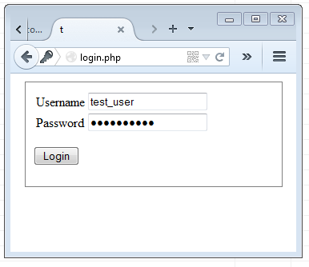

# PHP

For PHP, let's look at an example of a simple login page.



```
include: php_sql.def

page: login, basic_frame
    type: php
    phpcode: process
        $call process_start

        $ifnz $_POST['user']
            $map loadpost, user, pass
            $call check_login, $user, $pass

        $call check_logged_in
        $ifnz $logged_in
            #-- proceed --

    phpcode: content
        $ifnz $logged_in
            $p
                PRINT logged_in
        $elifnz $fail
            $p
                PRINT login error

        unset($pass)
        $call login_form
        $call showinfo

    htmlcode: login_form
        CSS: .login_box {width: 300px; padding: 10px 10px; margin: 10px auto; border: 1px solid gray}
        $div login_box
            $form login
                $table
                    $call form_input, Username, user
                    $call form_input, Password, pass
                $p
                    $call input_submit, Login


#---------------------------------------- 
phpcode: process_start
    $call session_start
    $dbhost="localhost"       
    $dbuser="test"           
    $dbpass="test"      
    $dbname="test"    
    $call database_start      

phpcode: check_login(user, pass)
    $fail=1
    $sqlrun SELECT id, password, salt FROM users WHERE username='$(user)' LIMIT 1
    $if !$empty 
        $t=hash('sha512', $(pass).$salt)
        $if $password==hash('sha512', $(pass).$salt)
            $fail=0
            $call set_logged_in
    $if $fail
        $call logout
        unset($_SESSION['id'])

phpcode: set_logged_in
    $browser=$_SERVER['HTTP_USER_AGENT']
    $_SESSION['id']=$id
    $_SESSION['hash']=hash('sha512', $password.$browser)
    $logged_in=1

phpcode: logout
    $logged_in=0
    unset($_SESSION['id'])
    unset($_SESSION['hash'])

phpcode:: check_logged_in
    $logged_in=0
    $ifnz $_SESSION['id']
        $sqlrun SELECT password FROM users WHERE id={$_SESSION['id']}
        $if !$empty
            $if $_SESSION['hash']==hash('sha512', $password.$browser)
            $logged_in=1
            


```
Compile with:
```
$ mydef_page -mwww login.def
PAGE: login
  --> [./login.php]
```

Here is login.php:
```
<?php
session_start();
$errors=array();
$infos=array();
$dbhost="localhost";
$dbuser="test";
$dbpass="test";
$dbname="test";
if($dbhost){
    if(empty($db0)){
        $db0=mysql_connect($dbhost, $dbuser, $dbpass);
        if(!$db0){
            if(mysql_errno()){
                $errors[]='Database: '.mysql_error();
            }
            else{
                $errors[]='Database: '.$php_errormsg;
            }
        }
        mysql_select_db($dbname);
    }
}
if(!empty($_POST['user'])){
    if(array_key_exists('user', $_POST)){
        $user=$_POST['user'];
    }
    if(array_key_exists('pass', $_POST)){
        $pass=$_POST['pass'];
    }
    $fail=1;
    $sql = "SELECT id, password, salt FROM users WHERE username='$user' LIMIT 1";
    $r=mysql_query($sql);
    if(!$r){
        $infos[]="errsql: $sql";
        $tpage=addslashes($_SERVER["PHP_SELF"]);
        $tsql=addslashes($sql);
        mysql_query("INSERT INTO log_errsql (errsql, page) VALUES ('$tsql', '$tpage'");
        $errors[]="Database Error.";
    }
    $empty=1;
    if($r){
        $row=mysql_fetch_row($r);
        if($row){
            $empty=0;
            $id=$row[0];
            $password=$row[1];
            $salt=$row[2];
        }
    }
    if(!$empty){
        $t=hash('sha512', $pass.$salt);
        if($password==hash('sha512', $pass.$salt)){
            $fail=0;
            $browser=$_SERVER['HTTP_USER_AGENT'];
            $_SESSION['id']=$id;
            $_SESSION['hash']=hash('sha512', $password.$browser);
            $logged_in=1;
        }
    }
    if($fail){
        $logged_in=0;
        unset($_SESSION['id']);
        unset($_SESSION['hash']);
        unset($_SESSION['id']);
    }
}
$logged_in=0;
if(!empty($_SESSION['id'])){
    $sql = "SELECT password FROM users WHERE id={$_SESSION['id']}";
    $r=mysql_query($sql);
    if(!$r){
        $infos[]="errsql: $sql";
        $tpage=addslashes($_SERVER["PHP_SELF"]);
        $tsql=addslashes($sql);
        mysql_query("INSERT INTO log_errsql (errsql, page) VALUES ('$tsql', '$tpage'");
        $errors[]="Database Error.";
    }
    $empty=1;
    if($r){
        $row=mysql_fetch_row($r);
        if($row){
            $empty=0;
            $password=$row[0];
        }
    }
    if(!$empty){
        if($_SESSION['hash']==hash('sha512', $password.$browser)){
        }
        $logged_in=1;
    }
}
if(!empty($logged_in)){
}
?>
<!doctype html>
<html>
    <head>
        <meta charset="utf-8">
        <title>t</title>
        <style>
            .login_box  {width: 300px; padding: 10px 10px; margin: 10px auto; border: 1px solid gray}
            li.info  {font-size: 12px; color: green; margin: 10px}
            li.error  {font-size: 12px; color: red; font-weight: 700; margin: 10px}
        </style>
    </head>
    <body>
        <?php
        if(!empty($logged_in)){
            echo "<p>";
                echo "logged_in";
            echo "</p>";
        }
        elseif(!empty($fail)){
            echo "<p>";
                echo "login error";
            echo "</p>";
        }
        unset($pass);
        ?>
        <div class="login_box">
            <form class="login" action="<?=$_SERVER['PHP_SELF'] ?>" method="POST">
                <table>
                    <tr>
                        <td class="label">
                            Username
                        </td>
                        <td class="input">
                            <input type="text" class="textinput" name="user">
                        </td>
                    </tr>
                    <tr>
                        <td class="label">
                            Password
                        </td>
                        <td class="input">
                            <input type="password" class="textinput" name="pass">
                        </td>
                    </tr>
                </table>
                <p>
                    <input type="submit" value="Login">
                </p>
            </form>
        </div>
        <?php
        if($infos){
            echo "<ul class=\"infobox\">";
                foreach ($infos as $i){
                    print "<li class=\"info\">$i</li>";
                }
            echo "</ul>";
        }
        ?>
    </body>
</html>
```


