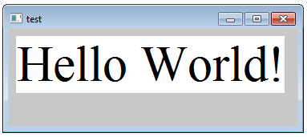

# Win32

Let's do a "Hello World" in Win32.



```
page: test, basic_frame
    $global hwnd_main
    $call wc_background, COLOR_BACKGROUND
    $call register_wndclass, "test", WndProc_main
    $call create_window, hwnd_main, "test"
    $call win_show, hwnd_main
    $call win_loop

# -------------------------------------------------
subcode: main_on_WM_PAINT
    &call on_paint
        $call quick_font, "Times New Roman", 72
        TextOut(hdc, 10, 10, "Hello World!", 12)
    return 0

```

Compile with 
```
$ mydef_page -mwin32 test.def
PAGE: test
  --> [test.c]
```

And the output:
```
#define _CRT_SECURE_NO_WARNINGS
#define WIN32_LEAN_AND_MEAN
#include <windows.h>
#define snprintf sprintf_s

LRESULT CALLBACK WndProc_main(HWND hwnd, UINT msg, WPARAM wparam, LPARAM lparam);

HINSTANCE cur_instance;
HWND hwnd_main;

int APIENTRY WinMain(HINSTANCE hInst, HINSTANCE hPrev, LPSTR s_cmdline, int n_cmdshow){
    WNDCLASSEX wc;
    MSG msg;

    cur_instance=hInst;
    wc.hbrBackground = (HBRUSH)COLOR_BACKGROUND;
    wc.cbSize = sizeof(WNDCLASSEX);
    wc.hInstance = cur_instance;
    wc.cbClsExtra = 0;
    wc.style = 0;
    wc.hIcon = NULL;
    wc.hIconSm = NULL;
    wc.hCursor = LoadCursor(NULL, IDC_ARROW);
    wc.lpszMenuName = NULL;
    wc.lpszClassName = "test";
    wc.lpfnWndProc = WndProc_main;
    wc.cbWndExtra = 0;
    RegisterClassEx(&wc);
    hwnd_main = CreateWindowEx(0, "test", "test", WS_OVERLAPPEDWINDOW, CW_USEDEFAULT, CW_USEDEFAULT, CW_USEDEFAULT, CW_USEDEFAULT, NULL, NULL, cur_instance, NULL);

    ShowWindow(hwnd_main, n_cmdshow);
    UpdateWindow(hwnd_main);

    while(GetMessage(&msg, NULL, 0, 0) > 0){
        TranslateMessage(&msg);
        DispatchMessage(&msg);
    }
    return 0;
}

LRESULT CALLBACK WndProc_main(HWND hwnd, UINT msg, WPARAM wparam, LPARAM lparam){
    PAINTSTRUCT ps;
    HDC hdc;
    HFONT t_new_font;
    HGDIOBJ t_old_font;

    switch(msg){
        case WM_PAINT:
            hdc = BeginPaint(hwnd, &ps);
            t_new_font = CreateFont(72, 0, 0, 0, FW_DONTCARE, FALSE, FALSE, FALSE, ANSI_CHARSET, OUT_DEFAULT_PRECIS, CLIP_DEFAULT_PRECIS, DEFAULT_QUALITY, FF_DONTCARE, "Times New Roman");
            t_old_font = SelectObject(hdc, t_new_font);
            TextOut(hdc, 10, 10, "Hello World!", 12);
            EndPaint(hwnd, &ps);
            SelectObject(hdc, t_old_font);
            DeleteObject(t_new_font);
            return 0;
            break;
        case WM_DESTROY:
            PostQuitMessage(0);
            return 1;
    }
    return DefWindowProc(hwnd, msg, wparam, lparam);
}

```

For compatibility, we'll finish the compiling with Microsoft Visual Studio's DOS prompt:
```
>cl /W3 test.c user32.lib gdi32.lib
Microsoft (R) 32-bit C/C++ Optimizing Compiler Version 16.00.30319.01 for 80x86
Copyright (C) Microsoft Corporation.  All rights reserved.

test.c
Microsoft (R) Incremental Linker Version 10.00.30319.01
Copyright (C) Microsoft Corporation.  All rights reserved.

/out:test.exe
test.obj
user32.lib
gdi32.lib
```

